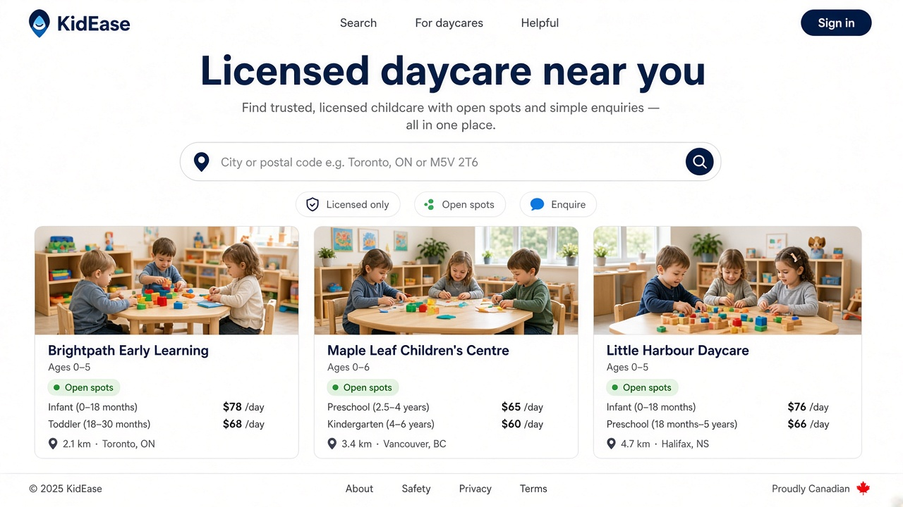
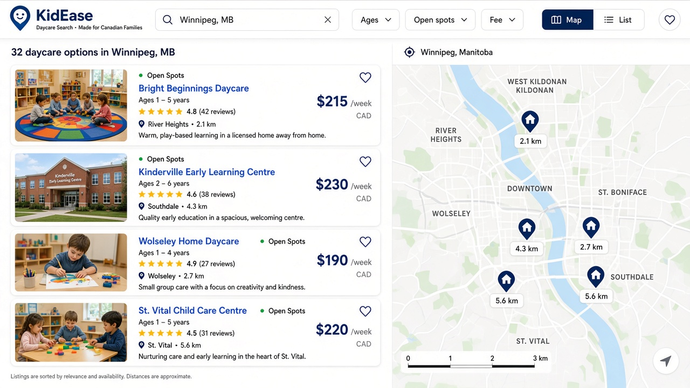
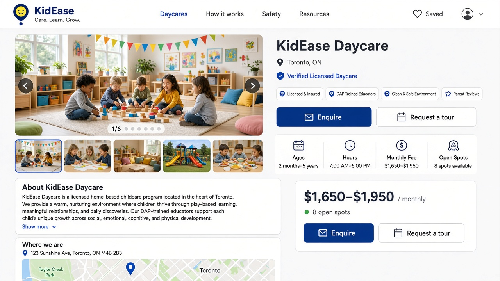

# Steal the feel — Home, Search, Listing

Implementable UX polish kit for KidEase (Canada only). Steal **clarity patterns** from best-in-class marketplaces (search-first home, photo-first results, gallery-first listing, sticky enquire). Do **not** steal pixels, logos, copy, or brand assets from Uber, Airbnb, or anyone else.

Brand stays KidEase navy `#1A3790`. Soft wash is `#EEF2FB`. One type scale, one radius, one shadow — see [TOKENS.md](./TOKENS.md).

This folder is a brief + checklist. It does **not** change production behaviour.

## Principles

1. **Feel, not pixels.** Hierarchy, density, and motion — not competitor chrome.
2. **Canada product only.** Licensed daycare, CAD, km, city / FSA / postal. No US frames.
3. **Honest listings.** No invented openings, ratings, or verified badges. Placeholders stay labelled, never dressed as photos.
4. **One job per surface.** Home finds a place. Search compares. Listing decides (enquire / tour).
5. **Ship tokens first.** If type, radius, or shadow forks, the feel falls apart before the layout does.

## How to use

1. Read [BRIEF.md](./BRIEF.md) for steal / drop / fix per page and the priority queue.
2. Apply [TOKENS.md](./TOKENS.md) (proposal in `tokens.css` / `tokens.ts` — not wired into `src/styles.css`).
3. Work [CHECKLIST.md](./CHECKLIST.md) in order. Tick only what you can point at in a PR.
4. Re-check [CAPTURE.md](./CAPTURE.md) on a **guest** session before review.

Related in-repo: [canada-parent-ux.md](../canada-parent-ux.md), [image-resizing.md](../image-resizing.md), [RESPONSIVE.md](../../RESPONSIVE.md).

## Direction mocks

Attached feel-pass frames (Home / Search / Listing). Direction only — not production screenshots.

| Surface | Mock | Intent |
| --- | --- | --- |
| Home | [mock-home.png](./mock-home.png) | Search is the only primary above the fold. Trust chips. Photo cards. |
| Search | [mock-search.png](./mock-search.png) | Photo-first rows + sticky chips. List \| map. Map does not eat the viewport. |
| Listing | [mock-listing.png](./mock-listing.png) | Gallery first, then title / facts. Sticky Enquire + Request a tour. |

## Code map (today)

| Surface | Route | Notes |
| --- | --- | --- |
| Home | `src/routes/index.tsx` | Website hero has two large buttons plus a location form. Guest home also mounts `RoleEnrollChooser`. |
| Search | `src/routes/search.tsx` | Cards map the full list (no virtualize). Map pane is `62dvh` / `70vh`. Chip row is `flex-nowrap` + `overflow-x-auto`. |
| Listing | `src/routes/daycare.$slug.tsx` | `/listing/:slug` soft-404s here. Hero is `aspect-[16/10]` / `md:aspect-[2/1]`. Mobile sticky bar already exists (`Request info` / `Book a tour`). |
| Cards | `src/components/daycare-card.tsx` | Already photo-first (`aspect-[4/3]`). Hollow / placeholder stills can still dominate a mixed Winnipeg–Edmonton–QA result set. |
| Tokens | `src/styles.css` `@theme` | Several radii and two shadows. Primary already `#1a3790`. Hero already washes `#eef2fb`. |
| Desk chrome | `src/components/desk-switcher.tsx` | `showDeskSwitcher` when the session has two visible desks — appears if the session is not a pure guest. |

## Out of scope

- Production layout or copy changes in this PR.
- Competitor brand marks, screenshots of other products, or cloned type ramps.
- Invented vacancy, reviews, or licence badges.
- Provider / admin desks (except: hide desk switcher for guest review).
